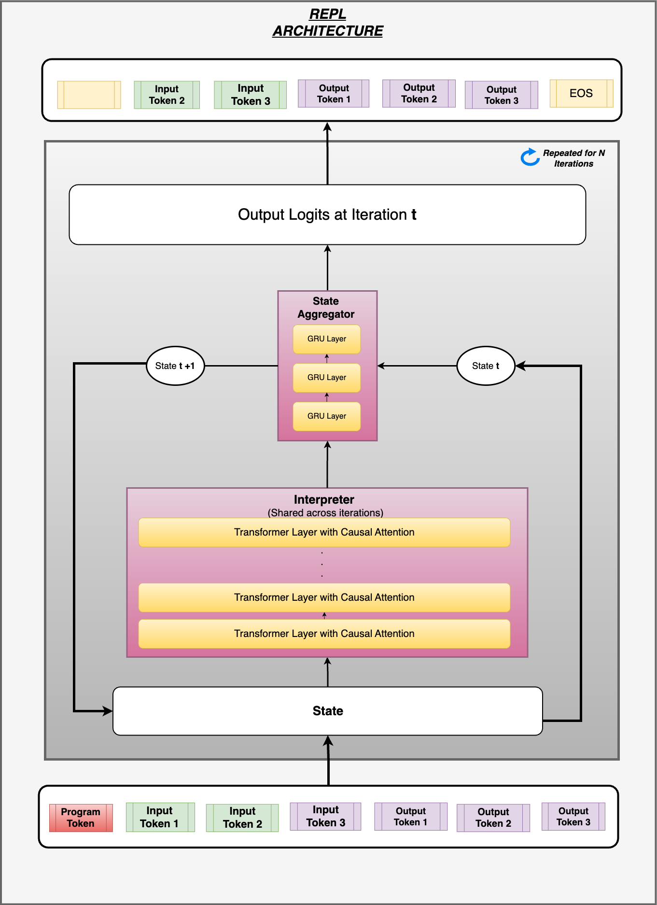

# ArcSolver
This is my attempt to solving arc puzzles using Deep Learning.

## Innovation Tracker
- Task Augmentation
- Program Embedding
- REPL architecture with Loops
- Progressive Loss
- Decoder only Encoder-Decoder architecture
- Input Injection
- LazyW optimizer
- Embedding L1 Regularization
- Embedding Norm Pinning
- Test time adaption using gradient descent
- Beam / Greedy Search (cached)
- Scripted model for speed
- Identity Block Expansion

## REPL Network Architecture Diagram
The aim is to simulate a REPL Loop by running a transformer based Interpter over input, and program to progressively update state. Output at each iteration is obtained from the state at that iteration. [Code Link](src/repl.py)

## WIP Innovation 
- Embedding Sparsity (Via forced sparsity)

## Version 2 Training Observations
-  Noticed that higher recurrence leads to better generalisation. Performs better on eval (but not on train)
    - https://wandb.ai/abhilab-hobby/baseline4dimv2/runs/v1.2.2?nw=nwuserabhilab
    - https://wandb.ai/abhilab-hobby/baseline4dimv2/runs/v1.2?nw=nwuserabhilab